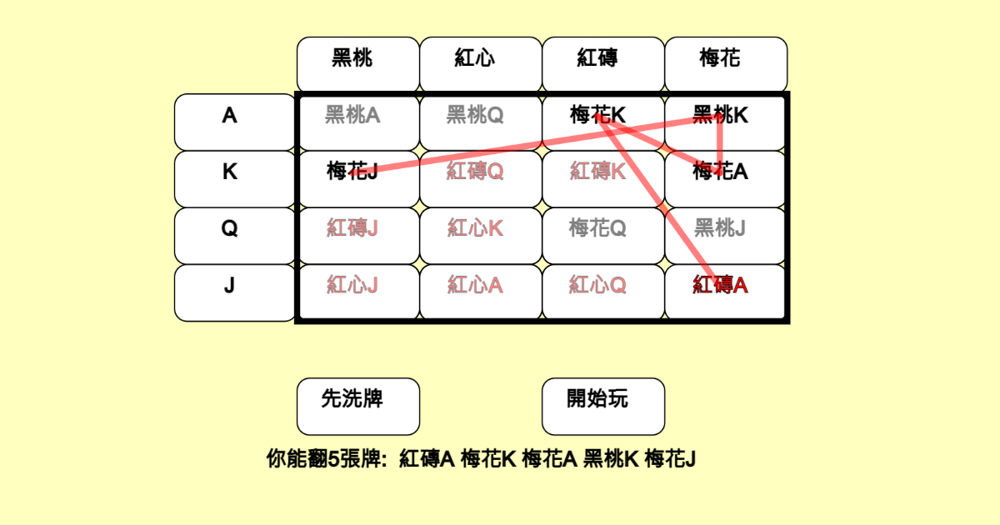
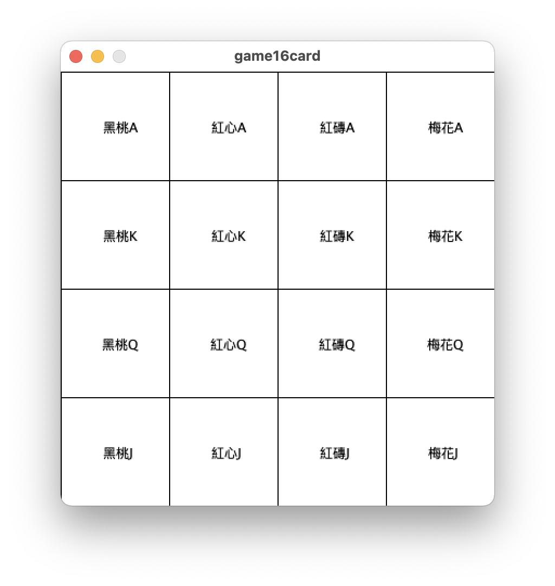
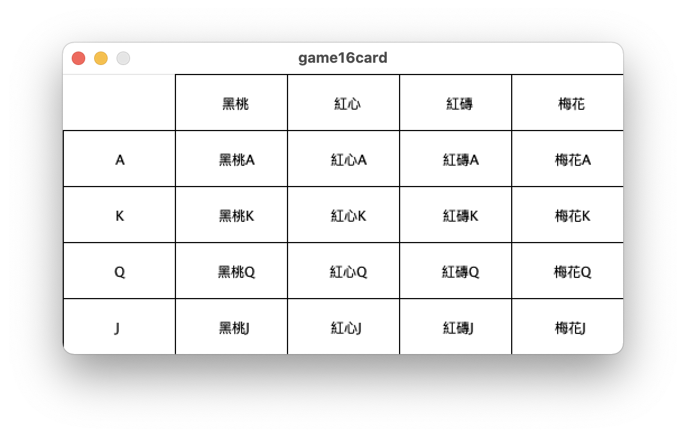
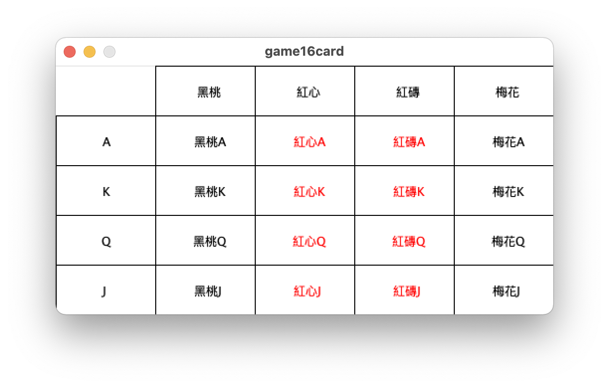
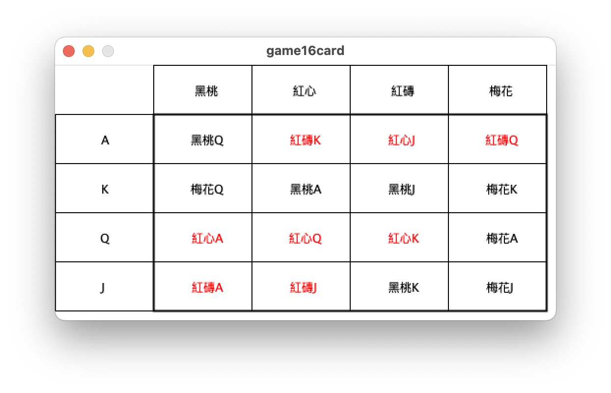
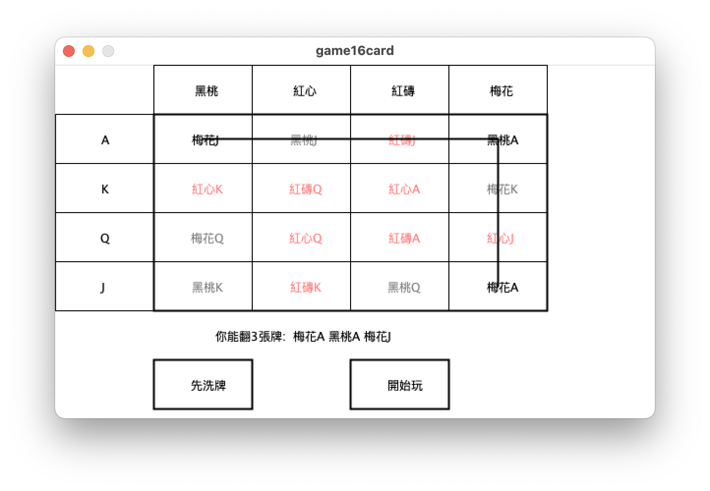
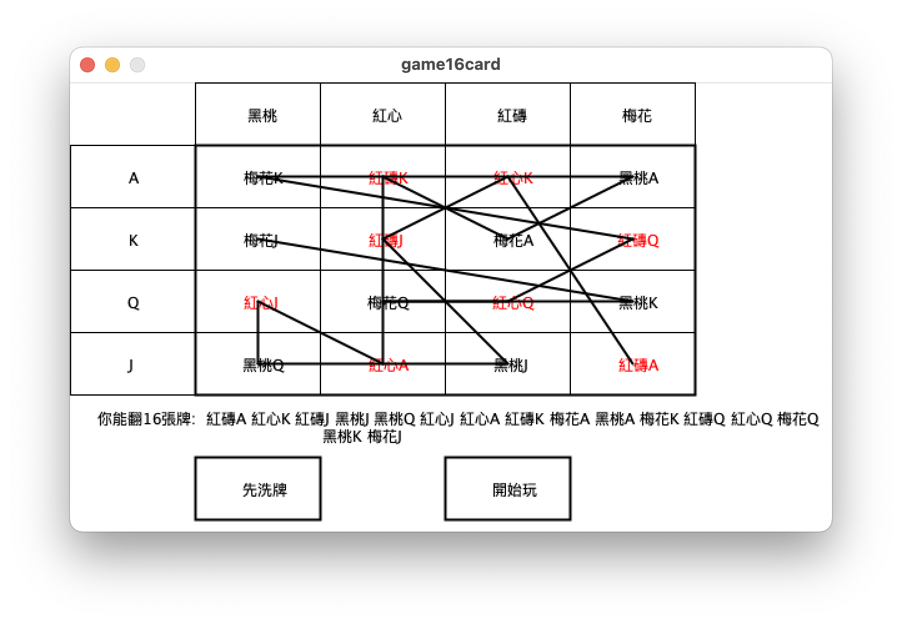

# game16card
設計一個撲克牌遊戲，只用16牌，隨機洗牌，放成4x4矩陣，再翻牌。

這個程式，是先用 Processinga 開發，之後再逐行翻譯成 p5.js 程式。

作者：葉正聖 jsyeh@mail.mcu.edu.tw

## p5.js 範例

[互動網頁示範](https://jsyeh.org/game16card/game16cardJS/)

[](https://jsyeh.org/game16card/game16cardJS/)


## step01 先用字串畫出圖

寫程式時，第一步，先能確認可以將字串畫出來，開心！



```processing
//看到網友林仕風的問題，要設計一個撲克牌遊戲，
//只用16牌，隨機洗牌，放成4x4矩陣，再翻牌
void setup(){
  size(400,400);
}
String []Face={"A","K","Q","J"};
String []Suit={"黑桃","紅心","紅磚","梅花"};
void draw(){
  background(255);
  textAlign(CENTER,CENTER);
  for(int i=0; i<4; i++){
    for(int j=0; j<4; j++){
      fill(255);
      rect(100*i, 100*j,100,100);
      fill(0);
      text(Suit[i]+Face[j], i*100+50,j*100+50);
    }
  }
}
```

## step02 表格畫面
因為網友的圖是個表格，所以想要模仿做出表格。
發明 `drawCard()` 函式簡化程式，




```processing
//看到網友林仕風的問題，要設計一個撲克牌遊戲，
//只用16牌，隨機洗牌，放成4x4矩陣，再翻牌
void setup(){
  size(500,250);
}
String []Face={"A","K","Q","J"};
String []Suit={"黑桃","紅心","紅磚","梅花"};
void drawCard(String t, int i, int j){
  fill(255);
  rect(100+100*i, 50+50*j, 100,50);
  fill(0);
  text(t, 100+50+100*i, 50+25+50*j);
}//做出函式 drawCard()來簡化程式碼

void draw(){
  background(255);
  textAlign(CENTER,CENTER);
  for(int i=0; i<4; i++){
    drawCard(Face[i], -1, i);
    drawCard(Suit[i], i, -1);
  }
  
  for(int i=0; i<4; i++){
    for(int j=0; j<4; j++){
      drawCard(Suit[i]+Face[j], i,j);
    }
  }
}
```

## step03 

解決卡片座標錯亂的問題。統一「左手i，右手j」來調整，讓左手i對應x座標，右手j對應y座標。



```processing
//看到網友林仕風的問題，要設計一個撲克牌遊戲，
//只用16牌，隨機洗牌，放成4x4矩陣，再翻牌
//Step03: 解決之前 i,j 錯亂的問題,並加紅色
//       j=0黑桃 j=1紅心 j=2紅磚 j=3梅花 (x座標)
//i=0 A
//i=1 K
//i=2 Q
//i=3 J
//(y座標）
void setup(){
  size(500,250);
}
String []Face={"A","K","Q","J"};//Face[i]
String []Suit={"黑桃","紅心","紅磚","梅花"};//Suit[j]
void drawCard(String t, int i, int j){
  fill(255);
  rect(100+100*j, 50+50*i, 100,50);
  //4x4的卡片區 適時字變紅色
  if(i>=0 && t.charAt(0)=='紅') fill(#ff0000);
  else fill(0);
  text(t, 100+50+100*j, 50+25+50*i);
}//step02: 做出函式 drawCard()來簡化程式碼

void draw(){
  background(255);
  textAlign(CENTER,CENTER);
  for(int i=0; i<4; i++){
    drawCard(Face[i], i, -1);
  }
  for(int j=0; j<4; j++){
    drawCard(Suit[j], -1, j);
  }
  
  for(int i=0; i<4; i++){
    for(int j=0; j<4; j++){
      drawCard(Suit[j]+Face[i], i, j);
    }//step01: 先結合字串，以印出卡片花色＋牌面
  }
}
```

## step04 亂數洗牌

有了前面的基礎，便能嘗試洗牌的動作。使用 `card[i][j]` 做出卡片對照表，這時候只要把 `card[i][j]` 進行洗牌（shuffle），便能照著之前的基礎，畫出全部的牌，呈現洗牌的結果。




```processing
//看到網友林仕風的問題，要設計一個撲克牌遊戲，
//只用16牌，隨機洗牌，放成4x4矩陣，再翻牌
//Step03: 解決之前 i,j 錯亂的問題,並加紅色
//       j=0黑桃 j=1紅心 j=2紅磚 j=3梅花 (x座標)
//i=0 A
//i=1 K
//i=2 Q
//i=3 J
//(y座標）
int [][]card=new int[4][4];//Step04 洗牌用的對照表
void setup(){
  size(510,260);
  for(int c=0; c<4*4; c++){
    card[c%4][int(c/4)] = c;
  }
  shuffle();//Step04 洗牌
}
void shuffle(){//Step04 洗牌函式
  for(int k=0; k<1000; k++){
    int i1=int(random(4)), i2=int(random(4));
    int j1=int(random(4)), j2=int(random(4));
    int temp=card[i1][j1];
    card[i1][j1]=card[i2][j2];
    card[i2][j2]=temp;
  }  
}
String []Face={"A","K","Q","J"};//Face[i]
String []Suit={"黑桃","紅心","紅磚","梅花"};//Suit[j]
void drawCard(String t, int i, int j){
  fill(255);
  rect(100+100*j, 50+50*i, 100,50);
  //4x4的卡片區 適時字變紅色
  if(i>=0 && t.charAt(0)=='紅') fill(#ff0000);
  else fill(0);
  text(t, 100+50+100*j, 50+25+50*i);
}//step02: 做出函式 drawCard()來簡化程式碼

void draw(){
  background(255);
  strokeWeight(1);
  textAlign(CENTER,CENTER);
  for(int i=0; i<4; i++){
    drawCard(Face[i], i, -1);
  }
  for(int j=0; j<4; j++){
    drawCard(Suit[j], -1, j);
  }
  
  for(int i=0; i<4; i++){
    for(int j=0; j<4; j++){
      //step04: 將洗牌的結果 card[i][j] 換算出花色牌面
      int ii = card[i][j]%4, jj=int(card[i][j]/4);
      drawCard(Suit[jj]+Face[ii], i, j);
    }//step01: 先結合字串，以印出卡片花色＋牌面
  }
  
  noFill();//畫出右下角黑色大框，讓畫面重點更清楚
  strokeWeight(2);
  rect(100,50,400,200);
}
```


## step05 進行模擬

在進行模擬時，想要畫出很多線條，同時配合半透明的翻牌效果，加上字串秀出翻了哪些牌。

這個版本我有點貪心，想要做太多步驟，結果程式越寫越多，卻又遇到bug，結果收不了尾，造成程式碼太長。



```processing
//看到網友林仕風的問題，要設計一個撲克牌遊戲，
//只用16牌，隨機洗牌，放成4x4矩陣，再翻牌
//Step03: 解決之前 i,j 錯亂的問題,並加紅色
//       j=0黑桃 j=1紅心 j=2紅磚 j=3梅花 (x座標)
//i=0 A
//i=1 K
//i=2 Q
//i=3 J
//(y座標）
int [][]card=new int[4][4];//Step04 洗牌用的對照表
void setup(){
  size(610,360);
  for(int c=0; c<4*4; c++){
    card[int(c/4)][c%4] = c;
  }
}

void shuffle(){//Step04 洗牌函式
  for(int k=0; k<1000; k++){
    int i=int(random(4)), j=int(random(4));
    int i2=int(random(4)), j2=int(random(4));
    int temp=card[i][j];
    card[i][j]=card[i2][j2];
    card[i2][j2]=temp;
  }
  arrowN=-1;//step05 重設箭頭
  for(int i=0; i<16; i++) used[i]=false;
}

String []Face={"A","K","Q","J"};//Face[i]
String []Suit={"黑桃","紅心","紅磚","梅花"};//Suit[j]

void drawCard(String t, int i, int j){
  fill(255);
  rect(100+100*j, 50+50*i, 100,50);
  //4x4的卡片區 適時字變紅色
  if(i>=0 && t.charAt(0)=='紅') fill(#ff0000);
  else fill(0);
  text(t, 100+50+100*j, 50+25+50*i);
}//step02: 做出函式 drawCard()來簡化程式碼

void draw(){
  background(255);
  strokeWeight(1);
  textAlign(CENTER,CENTER);
  for(int i=0; i<4; i++){
    drawCard(Face[i], i, -1);
  }
  for(int j=0; j<4; j++){
    drawCard(Suit[j], -1, j);
  }
  
  for(int i=0; i<4; i++){
    for(int j=0; j<4; j++){
      //step04: 將洗牌的結果 card[i][j] 換算出花色牌面
      int ii = int(card[i][j]/4), jj=card[i][j]%4;
      drawCard(Suit[jj]+Face[ii], i, j);
      if(used[i*4+j]==false){//step05 模擬時，沒用的牌半透明
        fill(255,128); rect(100+j*100,50+i*50,100,50);
      }
    }//step01: 先結合字串，以印出卡片花色＋牌面
  }
  
  noFill();//畫出右下角黑色大框，讓畫面重點更清楚
  strokeWeight(2);
  rect(100,50,400,200);
  
  if(arrowN!=-1){//step05 draw Arrow
    String line="";
    for(int i=0; i<arrowN; i++){
      int ii=int(arrow[i]/4), jj=arrow[i]%4;
      int c = card[ii][jj];
      line += " "+Suit[c%4]+Face[int(c/4)];
      if(i==arrowN-1) break;
      drawArrow( arrow[i], arrow[i+1] );
    }
    fill(0);text("你能翻"+arrowN+"張牌: "+line, 20,250, width-200,50);
  }
  drawCard("先洗牌", 5, 0);
  drawCard("開始玩", 5, 2);
}

void mousePressed(){//step05 模擬遊戲進行
  int i=int(mouseY/50)-1, j=int(mouseX/100)-1;
  if(i==5 && j==0) shuffle();//先洗牌
  if(i==5 && j==2) genArrow();//開始玩
}

int [] arrow=new int[17];//arrow to the next card
int arrowN=-1;

boolean [] used=new boolean[16];//step05: 對應的格子有無走過
void genArrow(){//step05 用箭頭模擬遊戲進行
  for(int i=0; i<16; i++) used[i]=false;
  used[15]=true;//走過這張卡片
  arrow[0]=15;//右下角的卡片，存的是位置15
  arrowN=1;
  for(int i=0; i<16-1; i++){
    arrow[i+1] = nextCard(arrow[i]);
    if(used[arrow[i+1]]==true) break;//如果卡片走過，就不能走過去
    used[arrow[i+1]]=true;//走過下一張卡片
    arrowN++;
  }
}

int nextCard(int c){//下一張的位置
  int i=int(c/4), j=c%4;
  return card[i][j];
}

void drawArrow(int c1, int c2){
  int i=int(c1/4), j=int(c1%4);
  int i2=int(c2/4), j2=int(c2%4);
  line( 100+50+j*100, 50+25+i*50, 100+50+j2*100, 50+25+i2*50); 
}
```
## 最後結果


